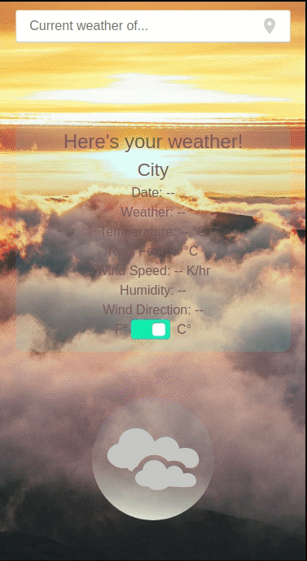

weather app
==============
Microverse WeatherApp Project for applying Asynchronous JS &amp; API

Mobile-first small aplication to make queries about weather selected by any place inserted into the search box. 

### Built with

- webpack
  - bulma
  - css-loader
  - file-loader
  - html-webpack-plugin
  - stylelint
  - eslint
- npm
  - places.js
- API service AerisWeather


## Live Version
Here: [click](https://rawcdn.githack.com/ricardovaltierra/weatherapp/20d7c10d053857e3f0a6f40ef613e815fe425a32/dist/index.html)

## Usage
### Insert a place to look for weather


You can clone the repo and run over your personal server.

## Getting Started

To get a local copy up and running follow these simple steps.

Clone or fork the <a href="https://github.com/ricardovaltierra/weatherapp">repo</a> [git@github.com:ricardovaltierra/weatherapp.git]

*note you need have install npm or yarn
* [npm](https://www.npmjs.com/get-npm)
* [yarn](https://classic.yarnpkg.com/en/docs/install)

<!-- HOW IT WORKS -->
## How it Works

This webpage is built on vanilla JS requiring you to set it on just have an account and credentials for the following API's:

* [Algolia Places](https://community.algolia.com/)
* [Aeris Weather](https://www.aerisweather.com/)

Both are free for usage. Once done just fill the credentials on `src/credentials.json`.

### Running the code

*   Navigate to the root directory of the project

*   Run this command on your terminal to add all the required packages and dependencies
    ```
    $ npm install
    ```
*   Now you can run with webpack and play with it
    ```
    $ npm run watch
    ```

## 🤝 Contributing

Contributions are more than welcome!<br/>Feel free to check [issues page]https://github.com/ricardovaltierra/weatherapp/issues).


1. Fork (https://github.com/ricardovaltierra/weatherapp/fork)
2. Create your working branch (git checkout -b [branch_name])
3. Commit your changes (git commit -am 'what you will add or fix or improve')
4. Push (git push origin [branch_name])
5. Create a PR

## 🤖 Contributor

Ricardo Valtierra - [GitHub](https://github.com/ricardovaltierra)

## 🙋‍♂ Support :)

Give a ⭐️ if you liked it!

## 📝 License

This project is under the [MIT](LICENSE) license.

## Creative Commons

Shield: [![CC BY-SA 4.0][cc-by-sa-shield]][cc-by-sa]

"plain weather icons" by [MerlinTheRed](https://www.deviantart.com/merlinthered/about#about) is licensed under [cc-by-sa]: https://creativecommons.org/licenses/by-sa/3.0/

[![CC BY-SA 3.0][cc-by-sa-image]][cc-by-sa]

[cc-by-sa-image]: https://licensebuttons.net/l/by-sa/3.0/88x31.png
[cc-by-sa-shield]: https://img.shields.io/badge/License-CC%20BY--SA%203.0-lightgrey.svg
